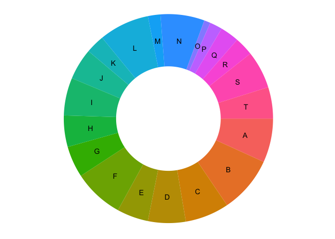
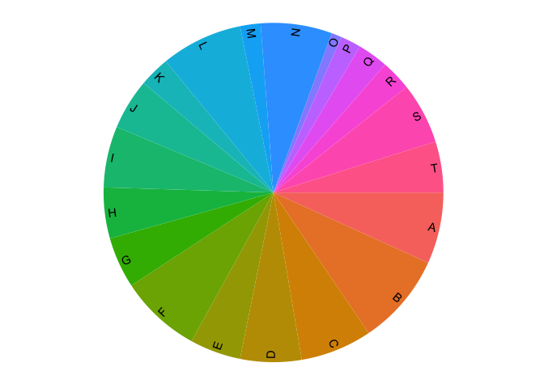
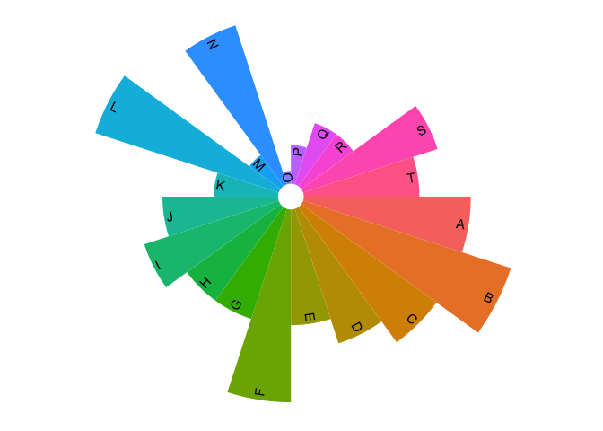
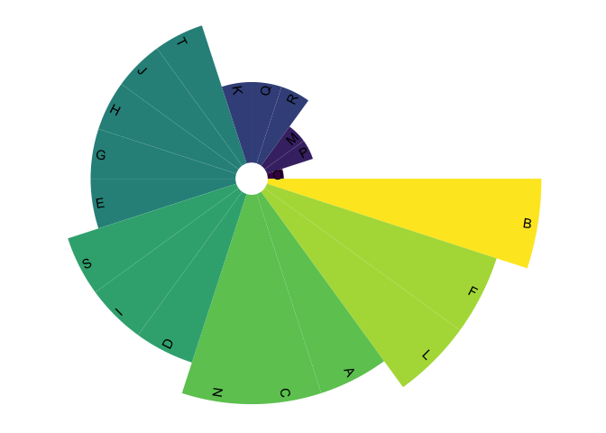

<!-- README.md is generated from README.Rmd. Please edit that file -->

# piechart

<!-- badges: start -->
<!-- badges: end -->

The goal of piechart is to draw a piechart simply and directly based on
‘ggplot2’.

## Installation

You can install piechart from [Github](https://github.com) with:

``` r
## install.packages("devtools")
devtools::install_github("Hy4m/piechart")
```

## Example

This is a basic example which shows you how to solve a common problem:

``` r
library(piechart)
## random dataset
set.seed(20210515)
dd <- tibble::tibble(value = rpois(20, 5),
                     label = LETTERS[1:20])

## Ring
piechart(dd, aes(value = value, label = label)) +
  geom_pie(aes(fill = label), show.legend = FALSE) +
  geom_pie_text()
```



``` r
## Pie
piechart(dd, aes(value = value, label = label), r0 = 0) +
  geom_pie(aes(fill = label), show.legend = FALSE) +
  geom_pie_text(facing = "clockwise", position = "top-inside")
```



``` r
## sunburst
piechart(dd, aes(r1 = value, label = label), value = 1, r0 = 0.5) +
  geom_pie(aes(fill = label), show.legend = FALSE) +
  geom_pie_text(facing = "clockwise", position = "top-inside")
```



``` r
piechart(dd, aes(r1 = value, label = label), value = 1, r0 = 0.5,
         sort_by = "value") +
    geom_pie(aes(fill = value), show.legend = FALSE) +
    geom_pie_text(facing = "clockwise", position = "top-inside") +
    ggplot2::scale_fill_viridis_c()
```



``` r

## arc heatmap
library(magrittr)
as.matrix(iris[-5]) %>% 
  as_piechart_data(start = 80, end = 100, r0 = 0.8) %>% 
  piechart(xlim = c(-1.2, 1.2), ylim = c(-1.2, 1.2)) +
  geom_pie(aes(fill = value), colour = "white", size = 0.3) +
  geom_rtext(position = "top-outside", size = 2.5) +
  geom_ctext(hjust = "middle", size = 2.5) +
  ggplot2::scale_fill_viridis_c()
```


